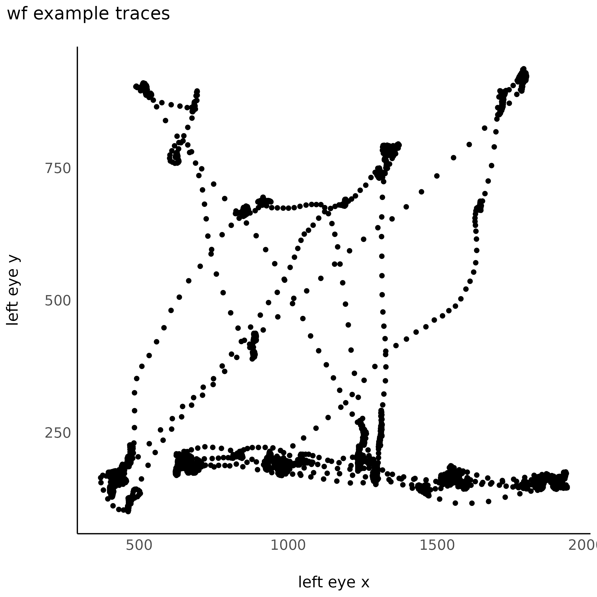

# Tangle Eye tracking test


## Setup
`make test` will install [`lncdtasks`](https://github.com/LabNeuroCogDevel/lncdtask/) with pip in a venv and exercise `./eyetest.py`.

Run like
```
# once to setup and confirm working
git clone https://github.com/NPACore/tangle-eye
cd tangle-eye
make test

. .venv/activate/bin # per session to use locally-installed python libraries
./eyetest.py         # to get the task dialog box
```

Use tracker = "None" as in the screenshot to demo without an eye tracker

## Eye Data
An `edf2asc` converted eyetracking file is in [`example/wf_20241126.asc`](example/wf_20241126.asc)

Retrive with `git lfs pull`. Plotting with `read.R`


## Flip images benchmark
Is it better to pre-render and flip one giant texture or generate display on the fly?
For real-time performance, it doesn't matter. See [`imgflip_benchmark.py`](imgflip_benchmark.py). Flip times are still limited by refresh rate (2 `win.flips()` at 60Hz = `0.033s`).

> flipped 10 images in 0.033s per iteration
> one large image flipped 0.033s per iteration


## Resources
For more eye tracking specific interface see 
  * [`pylink_help.py`](https://github.com/LabNeuroCogDevel/lncdtask/blob/main/lncdtask/pylink_help.py) for lncdtask code
  * [more info for use at the MRRC/scanner](https://rad.pitt.edu/wiki/doku.php?id=eyetracking:eyelink:task_integration)
  * [free-regirstation required SDK download on the EyeLink forums](https://www.sr-research.com/support/thread-13.html)
  * [SR Research EyeLink in Psychopy YouTube video](https://www.youtube.com/watch?v=1tLJHVktrEk)
